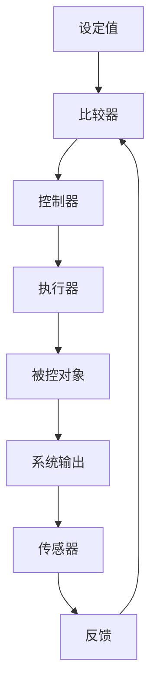

# PID控制系统学习(一)

## 控制系统的组成结构

组成：控制器、执行器、被控制对象、传感器

### 简化参数简写：（SP,err,CO,SO,FB）分别为(设定值，误差值，控制输出，系统输出，反馈)

### 关键指标:稳、准、快

举小球在重力作用下，在轻微扰动后可以在左图自发平衡

对于准的理解:对于一个复杂系统而言，例如烧水壶而言，存在散热，根据散热功率反推误差，然后得到实际温度，可知系统会一直稳定在这个误差设定值

### 对于指标，还存在下列参数：

#### 上升时间(tr)：从稳态的10%上升到90%所需的时间

#### 超调量(σ)：（最大值-设定值）/设定值 * 100%

#### 调节时间(ts)：开始到首次稳定在误差范围5%所需的时间

#### 稳态误差(ess)：设定值-误差值

